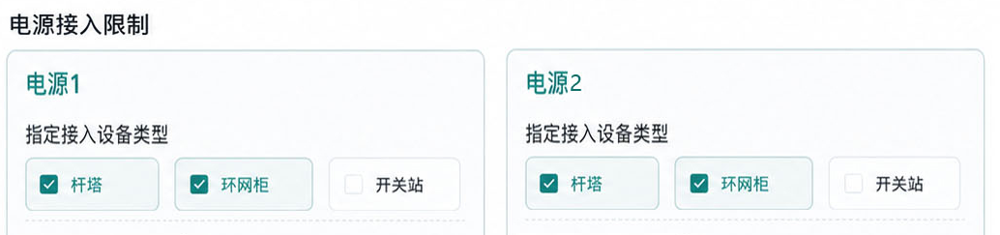

# 接入方案业务规则说明（高压10kV)

## 一、用户需求

业务类型：高压新装、高压增容、高压装表临时用电；供电电压为：10kV；用户受电变压器总容量不得超过20000kVA。

现场勘查阶段需明确的字段有，其中必填字段为：负荷性质、供电电压、需求类型、用电类别、核定合计合同容量、用户重要等级、用电地址等。选填字段为：联络方式、一二级负荷容量、电源数目、供电容量、电源性质等。营销2.0系统会将上述用电需求字段传递给PMS3.0系统。关于具体受电点位置应为配电房坐标，采用客户经理确认或现场定位的经纬度。

## 二、推理配置条件

业务人员在pms3.0系统接入方案正式推理之前，可调整智能推理系统的配置选项，具体包括以下功能模块：

**1.指定电源点接入设备类型**

系统提供杆塔、开关站、环网柜三种标准设备类型的定向选择功能，支持多选。生产人员通过勾选特定设备类型组合，最终方案将严格限定仅包含被勾选的指定设备类型。

{width="5.7625in" height="1.3541666666666667in"}

2.  **红线处新增设备选项（用户分界设备）**

此选项表示是否需要在用户红线处新建用户分界设备，默认勾选（注：在确定现场红线处已有可供接入的设备时可取消勾选）。大模型按以下规则推理设备类型。

架空接入：一二次融合柱上断路器。

电缆接入：接入容量大于等于5000kVA，应新建开关站作为接入点。开关站应在用户地块内贴邻红线建设，并设置于地面一层，预留运行和检修通道。小于5000kVA，可采用环网柜或开闭所接入，备用间隔数不小于2个。

**3.变电站新出线选项**

此选项为确定需要变电站新出线方式，系统将基于变电站新出线逻辑生成接入方案，不再进行常规在现有电源点中选取。

## 三、大模型推理

**（一）新装场景**

**1.电源点查询**

以用户受电点位置为中心，搜索周边电源点（从200米开始查询，后续按照500、800、1000扩散查询）所有电源点并进行罗列，若找不到电源点继续扩散，直到找到5条不同线路为止。对单电源用户，满足5条不同线路，形成单电源方案。对于一级重要用户采用双电源供电，双电源供电电源点需来自两个不同变电站，或来自不同电源进线的同一变电站内两段母线。5条线路至少保证两条线路来自不同变电站或者两条线路来自同一变电站两段母线，形成双电源组合。对于二级重要用户、临时性重要用户，至少应采用双回路供电，双回路供电电源点可来自同一变电站的不同母线。5条线路至少保证两条线路来自不同母线，形成双回路组合。普通电力用户应根据用电负荷重要程度及用户需求，采用双电源、双回路或单电源供电。原则上一级负荷采用双电源供电，二级负荷采用双回路供电，三级负荷可采用单电源供电。

**2.校核容量**

接入方案推荐电源点时，需同步校验关联馈线的可开放容量、当前负载率及对应主变的实时负载率，确保所选电源点满足电网承载能力要求。在供电距离最短的电源点中，若存在重载线路，需优先推荐并要求生产人员落实线路负载治理措施。

**（1）现有电源点筛选规则**

筛选电源点时，未重载的电源点，需满足以下基础约束：

1）所属馈线历史最大负载率 ＜ 80% （配网3号文要求）。

2）馈线可开放容量 ＞ 单路接入容量。

3）环网柜/开关站 备用间隔数 \>= 2。

4）馈线已接入用户数 ≤ 50 户（配网 3 号文要求）。

5）新增负荷接入此后，馈线线损率 ≤ 7%（待发展部确认）。

6）馈线所属变电站主变可开放容量 ＞ 单路接入容量。

7）馈线所属变电站主变负载率 ＜ 80%。

**（2）负荷划接规则**

推荐电源点供电距离较近时，若馈线负载率超过80%或主变负载率超过80%，需进行负荷转移方案设计。原则上应保持现有线路联络关系不变，优先利用现有分段开关、联络开关及当前运行方式实施负荷割接。

**1）馈线负载调整策略**

优先选取空间距离最近且具有充足负载裕度的相邻馈线作为接收对象，确保负荷割接后目标线路的最大负载率控制在80%以内。

**2）主变负载调整策略**

在同一个变电站内，选择通过联络开关连接当前负载较高的线路，通过优化运行方式或加装分段开关等措施，将部分负荷转移至其他负载较轻的主变，确保调整后目标主变的最大负载率不超过80%。

**3.变电站新出线**

满足下列任一条件，即触发变电站新出线逻辑：

（1）推理配置已勾选变电站新出线功能选项；

（2）单路电源供电容量≥5000kVA；

（3）电源点查询无符合要求的可用电源点；

（4）推荐电源点馈线负载率超 80% 需进行负荷割接，且其1000米范围内无满足割接条件的线路（割接条件：负荷割接后目标线路最大负载率≤80%）；

（5）推荐电源点主变负载率超 80% 需进行负荷割接，且该电源点所属变电站内无满足割接条件的主变（割接条件：负荷割接后目标主变最大负载率≤80%）。

**变电站新出线策略**

以用户受电点位置为中心，按由近至远顺序动态搜索15公里范围内的邻近变电站，优先判断各变电站是否存在空余间隔且其对应主变的可开放容量与实时负载率（不超过80%）均满足接入条件。若搜索到符合要求的变电站，则直接通过该变电站的间隔开关实现新出线接入供电，搜索范围不超过15公里；若15公里范围内未检索到任何同时满足空余间隔、主变负载率及可开放容量要求的变电站，则判定无可用接入方案。

**4.电源方案生成**

对筛选后的电源点按距离远近进行排序：单电源场景下选取不同线路中距离最近的接入点；双电源场景下选择来自不同线路且距离最近的电源接入点，同时须满足双电源配置要求；双回路场景下同样选取不同线路且距离最近的电源接入点，并确保符合双回路技术要求。若PMS前置推理已指定电源类型，则方案生成过程中仅推荐该指定类型的电源，不再推送其他类型电源方案。

**（二）增容场景**

首先校验原电源接入线路及其对应主变是否满足增容或新增接入需求：

若为单电源增容场景，仅评估原电源接入方案可行性，不考虑其他电源接入点；若原电源接入条件不满足，则需对原线路实施负荷划接，负荷划接规则与新装逻辑一致。

对于单电源增容升级为双电源的场景，一路保持采用原电源接入点（若原电源接入条件不满足，需对该线路进行负荷转移规划），另一路则按新装电源点推荐逻辑确定接入方案。

## 四、评分规则

**（一）评分生成**

对输出的所有电源方案，按供电距离、可开放容量、供电可靠性三个维度权重综合评分。

> **（1）供电距离（权重40%）**：越近得分越高。
>
> **（2）可开放容量（权重30%）**：容量越充足得分越高 。
>
> **（3）供电可靠性（权重30%）**：按电源数目和用户运行方式加权得分。

  --------------------------- -----------------------------------
             维度                            分值

   1.供电电源维度（占比50%）     （1）双电源或多电源供电100分\
                                     （2）双回路供电90分\
                                      （3）单电源供电80分

   2.运行方式维度（占比50%）      （1）同时供电互为备用100分\
                                      （2）同时供电90分\
                                      （3）一主一备80分\
                                       （4）一路主供70分
  --------------------------- -----------------------------------

**（二）方案输出**

（1）每种运行方式至少保留输出评分最高的1套，运行方式包括单电源供电、两路电源同时供电（双电源）、两路电源互为备用（双电源）、两路电源一主一备（双电源）、两路电源同时供电（双回路）、两路电源互为备用（双回路）、两路电源一主一备（双回路）。

（2）按评分高低输出不超过10套方案。

## 五、方案输出

以PDF预览方案展示大模型思考过程，包含用户用电需求、电源点选取、负荷切割说明、路径走向、新建公共接入点等信息。
